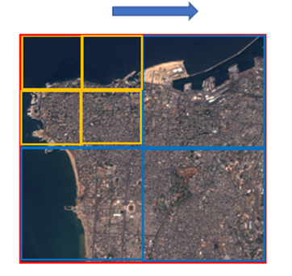
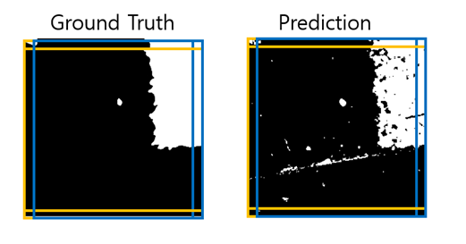

# 멀티 스케일을 반영한 위성영상 변화탐지 모델 연구

## Description
인류가 지구 표면을 촬영하기 시작한 이래로 위성영상에 대한 변화탐지 분야가 활발히 진행되었다. 변화 탐지란 서로 다른 시간 간격으로 촬영된 여러 이미지에서 관심 영역의 변화를 식별하는 작업을 말한다. 최근 변화탐지는 빠르게 발전하는 딥러닝 기법과 함께 지도학습 방식의 의미론적 분할 접근법으로 활발히 연구되고 있다.

하지만, 기존 변화탐지 모델은 입력 영상의 스케일에 따라 변화탐지 결과가 달라지고, 이로인해 총체적인 성능이 하락하는 결과가 나타난다. 본 연구에서는 입력영상의 크기에 강건하게 대응하는 변화탐지 모델을 구현하기 위한 간단한 기법들의 조합을 제안한다. 기존 지도학습 기반 변화탐지 모델의 아키텍처를 수정하여 다중 스케일에 대한 변화탐지를 수행하고, 이를 기반으로 변화탐지 결과물의 정확도를 끌어 올린다. 추가로 픽셀 간 그라디언트를 계산하여 변화탐지 영역의 형태를 보존하는 Edge Preserving Loss 손실함수를 구현하여 정확도를 끌어 올리려고 시도한다.

## Multitile

512 X 512 크기의 변화 전-변화 후 이진 시계열 위성영상 쌍을 입력 받는다고 가정하자. Multitile 기법에서는 512 X 512, 256 X 256, 128 X 128의 3단계로 피드 포워딩 및 Loss 계산을 실시하여 각각 광역정보, 중간정보, 국소정보를 반영한 변화탐지 결과물을 제작하는데 그 목표를 둔다. 
먼저 512 X 512 위성영상 전체를 백본 모델에 피드 포워드 한 후 Loss를 계산하고, 이를 L_512라고 설정한다(상기 사진의 빨간 범위). 이를 통해 변화탐지 결과물에 전체 위성영상의 광역정보를 반영시키는 Loss를 구할 수 있다. 이는 CNN의 Zero Padding에 따른 외곽정보의 부정확성을 최소한으로 줄이려는 시도이다.

그 다음, 512 X 512 위성영상 전체를 256 X 256 윈도우로 4분할 하여 각 백본 모델에 피드 포워드 후 Loss를 계산하고, 이를 L_256이라고 설정한다(상기 사진의 파란 범위). 이를 통해 변화탐지 결과물에 중간정보를 반영시키는 Loss를 구할 수 있다. 
마지막으로, 512 X 512 위성영상 전체를 128 X 128 윈도우로 16 분할 하여 각 백본 모델에 피드 포워드 후 Loss를 계산하고, 이를 L_128 이라고 설정한다(상기 사진의 노란 범위). 이를 통해 변화탐지 결과물에 국소정보를 반영시키는 Loss를 구할 수 있다. 이는 전체 영상 변화탐지 영역의 엣지 디테일 부분을 향상시키려는 의도이다.

백본 모델은 SNUnet-CD이며, Loss는 SNUnet의 기본 Loss인 Hybrid Loss를 사용했다. Hybrid Loss란 Dice Loss와 Focal Loss를 5:5 비율로 반영한 Loss 를 말한다.

오차 역전파에 사용할 L_entire는 L_512, L_256, L_128을 일정 비율 λ로 합하여 도출한다. 실험에서는 λ_512를 0.7, λ_256을 0.2, λ_128을 0.1로 반영했다. 이는 512 X 512의 영향력을 가장 강하게 주어 광역정보를 많이 반영하도록 하되, 작은 스케일을 가진 위성영상의 디테일을 소폭 반영하려는 의도이다.

## EPL (Edge Preserving Loss)

먼저 512 X 512 크기의 변화탐지 결과물이 출력되었으며 정답 이미지 (Ground Truth) 역시 같은 크기라고 가정하자. 정답 이미지에 대해 512 X 511 크기의 윈도우를 가장 오른쪽 1px 너비의 열만 남겨두게끔 놓고 이를 A라고 한다. 그 다음, 해당 윈도우를 우측으로 1px 이동시켜서 가장 왼쪽 1px 너비의 열만 남겨두게끔 놓고 이를 B라고 한다. A와 B에 대해 픽셀 별 절대값 연산을 취하여 정답 이미지에 대한 수평방향 그라디언트 GT_h를 구한다(상기 사진의 Ground Truth 파란 범위). 그런 다음, 같은 방식으로 예측 이미지 (Prediction)에 대해 수평방향 그라디언트 Predict_h를 구한다(상기 사진의 Prediction 파란 범위).

수평방향 그라디언트를 구했으므로 수직방향 그라디언트 역시 구해야 한다. 정답 이미지에 대해 511 X 512 크기의 윈도우를 가장 아래쪽 1px 너비의 행만 남겨두게끔 놓고 이를 A라고 한다. 그 다음, 해당 윈도우를 아래측으로 1px 이동시켜서 가장 위쪽 1px 너비의 행만 남겨두게끔 놓고 이를 B라고 한다. A와 B에 대해 픽셀 별 절대값 연산을 취하여 정답 이미지에 대한 수직방향 그라디언트 GT_v를 구한다(상기 사진의 Ground Truth 노란 범위). 그런 다음, 같은 방식으로 예측 이미지에 대한 수직방향 그라디언트 Predict_v를 구한다(상기 사진의 Prediction 노란 범위).

오차역전파에 사용할 최종 EPL은 GT_h – Predict_h의 L2 norm과 GT_v – Predict_v의 L2 norm의 합으로 구할 수 있다. 이는 정답 이미지와 예측 이미지 간 수직방향과 수평방향의 그라디언트 차를 구하므로써 모델로 하여금 변화탐지 영역의 엣지 부분을 정확하게 학습시키려는 의도이다. 

## Requirements

- Python 3.8

- Pytorch 1.8.1

- torchvision 0.9.0

## Dataset

- [CDD](https://drive.google.com/file/d/1GX656JqqOyBi_Ef0w65kDGVto-nHrNs9/edit) (Change Detection Dataset)
- [SCD](https://drive.google.com/file/d/1cAyKCjRiRKfTysX1OqtVs6F1zbEI0EGj/view?usp=sharing) (SECOND CD Dataset)

## Train from scratch
    
    python multitile.py

## Evaluate model performance

    python eval.py

## Test set visualization

    python visualization.py
   
## Demo

    python visualization.py
  
## compare data

    python compareDATA.py
